```mermaid
flowchart TB
    subgraph current["Finn.Desktop.csproj"]
        MAIN["<b>📦&nbsp;Finn.Desktop.csproj</b><br/><small>net8.0</small>"]
        click MAIN "#finndesktopfinndesktopcsproj"
    end
    subgraph downstream["Dependencies (1"]
        P1["<b>📦&nbsp;Finn.csproj</b><br/><small>net10.0</small>"]
        click P1 "#finnfinncsproj"
    end
    MAIN --> P1

```

```mermaid
flowchart TB
    subgraph upstream["Dependants (1)"]
        P2["<b>📦&nbsp;Finn.Desktop.csproj</b><br/><small>net8.0</small>"]
        click P2 "#finndesktopfinndesktopcsproj"
    end
    subgraph current["Finn.csproj"]
        MAIN["<b>📦&nbsp;Finn.csproj</b><br/><small>net10.0</small>"]
        click MAIN "#finnfinncsproj"
    end
    P2 --> MAIN

```

# Projects and dependencies analysis

This document provides a comprehensive overview of the projects and their dependencies in the context of upgrading to .NETCoreApp,Version=v10.0.

## Table of Contents

- [Executive Summary](#executive-Summary)
  - [Highlevel Metrics](#highlevel-metrics)
  - [Projects Compatibility](#projects-compatibility)
  - [Package Compatibility](#package-compatibility)
  - [API Compatibility](#api-compatibility)
- [Aggregate NuGet packages details](#aggregate-nuget-packages-details)
- [Top API Migration Challenges](#top-api-migration-challenges)
  - [Technologies and Features](#technologies-and-features)
  - [Most Frequent API Issues](#most-frequent-api-issues)
- [Projects Relationship Graph](#projects-relationship-graph)
- [Project Details](#project-details)

  - [Finn.Desktop\Finn.Desktop.csproj](#finndesktopfinndesktopcsproj)
  - [Finn\Finn.csproj](#finnfinncsproj)

## Executive Summary

### Highlevel Metrics

| Metric | Count | Status |
| :--- | :---: | :--- |
| Total Projects | 2 | 1 require upgrade |
| Total NuGet Packages | 17 | 1 need upgrade |
| Total Code Files | 45 |  |
| Total Code Files with Incidents | 1 |  |
| Total Lines of Code | 7277 |  |
| Total Number of Issues | 2 |  |
| Estimated LOC to modify | 0+ | at least 0,0% of codebase |

### Projects Compatibility

| Project | Target Framework | Difficulty | Package Issues | API Issues | Est. LOC Impact | Description |
| :--- | :---: | :---: | :---: | :---: | :---: | :--- |
| [Finn.Desktop\Finn.Desktop.csproj](#finndesktopfinndesktopcsproj) | net8.0 | 🟢 Low | 1 | 0 |  | WinForms, Sdk Style = True |
| [Finn\Finn.csproj](#finnfinncsproj) | net10.0 | ✅ None | 0 | 0 |  | ClassLibrary, Sdk Style = True |

### Package Compatibility

| Status | Count | Percentage |
| :--- | :---: | :---: |
| ✅ Compatible | 16 | 94,1% |
| ⚠️ Incompatible | 1 | 5,9% |
| 🔄 Upgrade Recommended | 0 | 0,0% |
| ***Total NuGet Packages*** | ***17*** | ***100%*** |

### API Compatibility

| Category | Count | Impact |
| :--- | :---: | :--- |
| 🔴 Binary Incompatible | 0 | High - Require code changes |
| 🟡 Source Incompatible | 0 | Medium - Needs re-compilation and potential conflicting API error fixing |
| 🔵 Behavioral change | 0 | Low - Behavioral changes that may require testing at runtime |
| ✅ Compatible | 14 |  |
| ***Total APIs Analyzed*** | ***14*** |  |

## Aggregate NuGet packages details

| Package | Current Version | Suggested Version | Projects | Description |
| :--- | :---: | :---: | :--- | :--- |
| Avalonia | 11.3.11 |  | [Finn.csproj](#finnfinncsproj) | ✅Compatible |
| Avalonia.Controls.ColorPicker | 11.3.11 |  | [Finn.csproj](#finnfinncsproj) | ✅Compatible |
| Avalonia.Controls.DataGrid | 11.3.11 |  | [Finn.csproj](#finnfinncsproj) [Finn.Desktop.csproj](#finndesktopfinndesktopcsproj) | ✅Compatible |
| Avalonia.Desktop | 11.3.11 |  | [Finn.Desktop.csproj](#finndesktopfinndesktopcsproj) | ✅Compatible |
| Avalonia.Diagnostics | 11.3.11 |  | [Finn.csproj](#finnfinncsproj) | ✅Compatible |
| Avalonia.Fonts.Inter | 11.3.11 |  | [Finn.csproj](#finnfinncsproj) | ✅Compatible |
| Avalonia.Themes.Fluent | 11.3.11 |  | [Finn.csproj](#finnfinncsproj) | ✅Compatible |
| CommunityToolkit.Mvvm | 8.4.0 |  | [Finn.csproj](#finnfinncsproj) | ✅Compatible |
| DotNetCampus.AvaloniaInkCanvas | 1.0.1 |  | [Finn.csproj](#finnfinncsproj) | ✅Compatible |
| FluentIcons.Avalonia | 1.2.315 |  | [Finn.csproj](#finnfinncsproj) | ✅Compatible |
| itext | 9.5.0 |  | [Finn.csproj](#finnfinncsproj) | ✅Compatible |
| itext.bouncy-castle-adapter | 9.5.0 |  | [Finn.csproj](#finnfinncsproj) | ✅Compatible |
| iTextSharp | 5.5.13.4 | 5.5.13.3 | [Finn.Desktop.csproj](#finndesktopfinndesktopcsproj) | ⚠️NuGet package is incompatible |
| MuPDFCore | 2.0.1 |  | [Finn.csproj](#finnfinncsproj) | ✅Compatible |
| MuPDFCore.MuPDFRenderer | 2.0.1 |  | [Finn.csproj](#finnfinncsproj) | ✅Compatible |
| Newtonsoft.Json | 13.0.4 |  | [Finn.csproj](#finnfinncsproj) | ✅Compatible |
| System.Drawing.Common | 10.0.2 |  | [Finn.csproj](#finnfinncsproj) | ✅Compatible |

## Top API Migration Challenges

### Technologies and Features

| Technology | Issues | Percentage | Migration Path |
| :--- | :---: | :---: | :--- |

### Most Frequent API Issues

| API | Count | Percentage | Category |
| :--- | :---: | :---: | :--- |

## Projects Relationship Graph

Legend:
📦 SDK-style project
⚙️ Classic project

```mermaid
flowchart LR
    P1["<b>📦&nbsp;Finn.csproj</b><br/><small>net10.0</small>"]
    P2["<b>📦&nbsp;Finn.Desktop.csproj</b><br/><small>net8.0</small>"]
    P2 --> P1
    click P1 "#finnfinncsproj"
    click P2 "#finndesktopfinndesktopcsproj"

```

## Project Details

### Finn.Desktop\Finn.Desktop.csproj

#### Project Info

- **Current Target Framework:** net8.0
- **Proposed Target Framework:** net10.0-windows
- **SDK-style**: True
- **Project Kind:** WinForms
- **Dependencies**: 1
- **Dependants**: 0
- **Number of Files**: 2
- **Number of Files with Incidents**: 1
- **Lines of Code**: 23
- **Estimated LOC to modify**: 0+ (at least 0,0% of the project)

#### Dependency Graph

Legend:
📦 SDK-style project
⚙️ Classic project

### API Compatibility

| Category | Count | Impact |
| :--- | :---: | :--- |
| 🔴 Binary Incompatible | 0 | High - Require code changes |
| 🟡 Source Incompatible | 0 | Medium - Needs re-compilation and potential conflicting API error fixing |
| 🔵 Behavioral change | 0 | Low - Behavioral changes that may require testing at runtime |
| ✅ Compatible | 14 |  |
| ***Total APIs Analyzed*** | ***14*** |  |

### Finn\Finn.csproj

#### Project Info

- **Current Target Framework:** net10.0✅
- **SDK-style**: True
- **Project Kind:** ClassLibrary
- **Dependencies**: 0
- **Dependants**: 1
- **Number of Files**: 44
- **Lines of Code**: 7254
- **Estimated LOC to modify**: 0+ (at least 0,0% of the project)

#### Dependency Graph

Legend:
📦 SDK-style project
⚙️ Classic project

### API Compatibility

| Category | Count | Impact |
| :--- | :---: | :--- |
| 🔴 Binary Incompatible | 0 | High - Require code changes |
| 🟡 Source Incompatible | 0 | Medium - Needs re-compilation and potential conflicting API error fixing |
| 🔵 Behavioral change | 0 | Low - Behavioral changes that may require testing at runtime |
| ✅ Compatible | 0 |  |
| ***Total APIs Analyzed*** | ***0*** |  |

